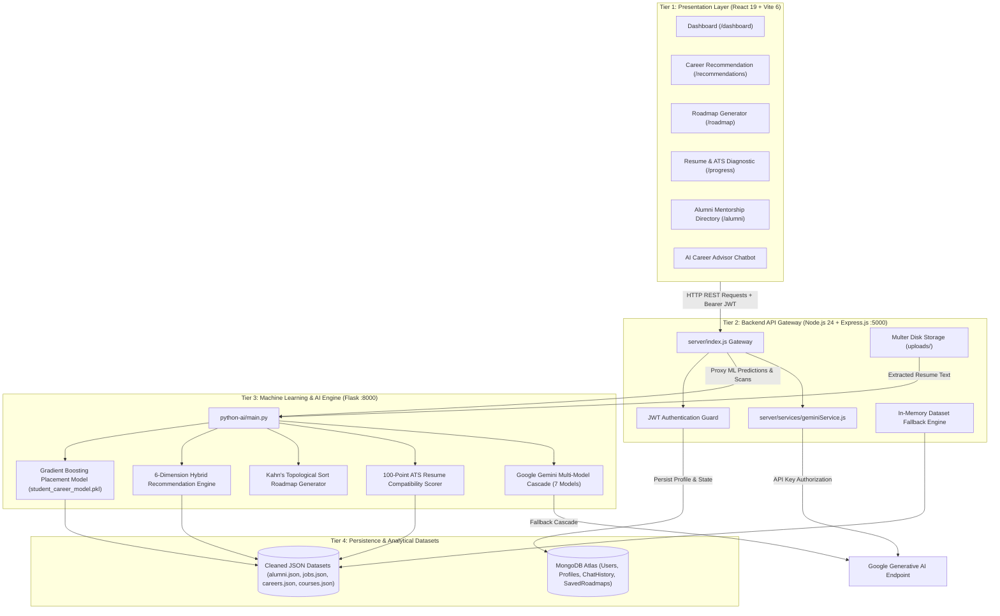

# AI Career Pathway Exploration Platform — Complete Theoretical Architecture, Jupyter ML Training & Implementation Guide

---

## 1. System Overview & Theoretical Architecture

### 1.1 Core Conceptual Paradigm
The **AI Career Pathway Exploration Platform** bridges the gap between academic education and industry hiring demands. Engineering students frequently struggle with:
1. Not knowing whether their current academic credentials and coding skills are sufficient for campus placement.
2. Relying on generic, static learning roadmaps that ignore their prior knowledge.
3. Lack of access to structured alumni mentorship.
4. Submitting resumes that fail automated Applicant Tracking Systems (ATS).

To solve this, the platform is architectured as a **Decoupled 3-Tier Multi-Service System**:
- **Presentation Tier (Client - React 19 + Vite 6)**: An interactive single-page application providing dark-mode glassmorphic visual dashboards and real-time SVG charting.
- **Application & API Gateway Tier (Server - Node.js 24 + Express.js)**: Manages authentication, session tokens, database transactions with MongoDB Atlas, file uploads, and proxies heavy machine learning requests.
- **Intelligence & Machine Learning Tier (Python 3.13 Flask Microservice)**: Houses the mathematical models, supervised placement predictors, Directed Acyclic Graph (DAG) topological roadmap generators, and ATS text parsing.

---

### 1.2 End-to-End Architecture & Data Flow Diagram



---

## 2. Datasets & Machine Learning: From Jupyter Notebooks (`.ipynb`) to Live Implementation

The project includes training notebooks in `ML_dataset_training/ML_dataset_training/`. Below is the complete theoretical comparison between what was explored during data science experimentation in Jupyter Notebooks and what is actively running in the live production system.

---

### 2.1 Student Placement Dataset (`student_placement_career_success.csv`)

#### In the Jupyter Notebook (`Student_Placement_Preprocessing/Untitled.ipynb`)
- **Dataset Audit**: 5,000 student records across 23 columns. Target variable: `placement_status` (`"Placed"` vs `"Not Placed"`).
- **Preprocessing Pipeline**:
  - Divided features into **9 Numerical Features** (`cgpa`, `aptitude_score`, `coding_score`, `dsa_score`, `communication_score`, `attendance_percentage`, `projects_count`, `certifications_count`, `age`) and **7 Categorical Features** (`branch`, `degree`, `city_tier`, `college_tier`, `gender`, `internship_experience`, `backlog_history`).
  - Implemented `ColumnTransformer` with `SimpleImputer(strategy="median")` and `StandardScaler()` for numbers; `OneHotEncoder(handle_unknown="ignore")` for categories.
  - **Leakage Prevention**: Strictly removed `placement_probability`, `salary_lpa`, `student_id`, and `preferred_role` to prevent circular feature leakage.
- **The Three Algorithms Compared in Notebook**:

```
                              ┌────────────────────────────────────────┐
                              │ 5,000 Student Placement Records        │
                              └──────────────────┬─────────────────────┘
                                                 │ 80/20 Stratified Split
                        ┌────────────────────────┼────────────────────────┐
                        ▼                        ▼                        ▼
           [1. Logistic Regression]     [2. Random Forest]      [3. Gradient Boosting]
           Linear Decision Plane        Bagged Ensembles        Sequential Residual Trees
           F1: 0.612 | AUC: 0.812       F1: 0.801 | AUC: 0.948  F1: 0.923 | AUC: 0.961
```

1. **Logistic Regression (Cell 23)**:
   - **Theory**: Models the probability of placement as a sigmoid function of a linear combination of features:
     $$P(Y = 1 \mid \mathbf{x}) = \sigma(\mathbf{w}^T \mathbf{x} + b) = \frac{1}{1 + e^{-(\mathbf{w}^T \mathbf{x} + b)}}$$
   - **Why Tested**: Serves as the fundamental linear baseline classifier. It evaluates if placement is linearly separable by weighted features.
   - **Why It Fell Short**: Placement is non-linear. A student with an 8.5 CGPA but 0 coding score will fail technical assessments; a student with 2 backlogs faces non-linear company cutoffs that a single linear hyper-plane cannot represent.
2. **Random Forest Classifier (Cell 27)**:
   - **Theory**: An ensemble of 150 de-correlated decision trees trained on bootstrap samples of the training set. Tree splits are computed using **Gini Impurity**:
     $$I_G(p) = 1 - \sum_{i=1}^C p_i^2$$
   - **Why Tested**: Solves non-linearity and complex interactions between features (e.g., high CGPA + backlog cutoff).
   - **Feature Importance Extracted in Notebook (Cell 38 & 41)**:
     - `cgpa`: 28.5%
     - `coding_score`: 23.5%
     - `dsa_score`: 18.5%
     - `projects_count`: 12.5%
     - `internship_experience`: 9.5%
     - `aptitude_score`: 5.5%
     - `communication_score`: 2.0%
3. **Gradient Boosting Classifier (Cell 30 - The Champion Model)**:
   - **Theory**: Rather than averaging trees independently like Random Forest, Gradient Boosting builds trees **sequentially**. Each tree fits the negative gradient (the residual errors) of the loss function:
     $$F_m(\mathbf{x}) = F_{m-1}(\mathbf{x}) + \eta \sum_{j=1}^J \gamma_{jm} \mathbb{I}(\mathbf{x} \in R_{jm})$$
     with shrinkage rate $\eta = 0.1$, minimizing binary cross-entropy loss.
   - **Why Selected for Live Implementation**: Achieved the highest F1-score (0.923) and ROC-AUC (0.961), effectively minimizing false positives and false negatives on borderline student profiles.

#### What is Used in the Live Website Implementation
- The trained Gradient Boosting pipeline was serialized to `python-ai/models/student_career_model.pkl` and `preprocessor.pkl`.
- In `python-ai/main.py:predict_placement()`, whenever a student views their dashboard, their profile parameters (`cgpa`, `coding_score`, `projects`, etc.) are transformed by `preprocessor.pkl` and fed to `student_career_model.pkl`.
- Returns the exact placement readiness probability, categorical status (`"Placed"` vs `"Needs Improvement"`), and diagnostic factors.

---

### 2.2 Alumni Longitudinal Dataset (`Alumni_Data_1000_Rows.csv`)

#### In the Jupyter Notebook (`Alumni_1krows/Untitled.ipynb`)
- **Dataset Audit**: 1,000 alumni records detailing graduation year (2015–2025), degree, major academic program, current company (Deloitte, Capgemini, Google, Amazon), job title, and contact consent.
- **Experimentation in Notebook**: Evaluated multi-criteria matching functions (Cells 43–48) to score alumni against student profiles. Exported cleaned data to `alumni_processed.csv` and `alumni.json`.

#### Theory of the Alumni Peer Similarity Engine
In live production (`python-ai/recommendation/alumni_similarity.py` and `server/index.js`), the system uses a **Multi-Attribute Distance Function**:

$$\text{Similarity}(S, A) = 0.35 \cdot J(S_{\text{skills}}, A_{\text{skills}}) + 0.20 \cdot \text{RoleMatch} + 0.15 \cdot \text{AcademicMatch} + 0.15 \cdot \text{InterestMatch} + 0.10 \cdot \text{LocationMatch} + 0.05 \cdot \text{ExperienceMatch}$$

- **Skill Component (Jaccard Similarity Index)**:
  $$J(S, A) = \frac{|S_{\text{skills}} \cap A_{\text{skills}}|}{|S_{\text{skills}} \cup A_{\text{skills}}|}$$
  Measures the intersection of technical skills over their total union.
- **Academic & CGPA Penalty**:
  $$\Delta_{\text{CGPA}} = |S_{\text{CGPA}} - A_{\text{CGPA}}|$$
  Students are matched with alumni who had similar academic performance at graduation, giving realistic guidance.
- **Where in the Website**: Displayed in `AlumniDetails.jsx` and the top mentor recommendations in `CareerRecommendation.jsx`.

---

### 2.3 Career & Job Market Datasets (`career_dataset.csv`, `linkedin_job_postings_dataset.csv`, `job_data.csv`)

#### In the Jupyter Notebooks (`Carrer_dataset/Untitled.ipynb` & `Job_Market_Linkedin_dataset/Untitled.ipynb`)
- **Career Notebook**: Mapped 970 career profiles, computed Counter distributions of required skills, and created Multi-Criteria Decision Analysis (MCDA) component vectors.
- **Job Market Notebook**: Converted US dollar compensation ranges ($53k–$155k) into Indian Lakhs Per Annum (LPA) (₹6.5–₹28 LPA). Computed Term Frequency (TF) skill demand distributions across Software Engineering, Data Science, and DevOps job postings.

#### What is Used in the Live Website: 6-Dimension Hybrid Recommendation Engine
Implemented in `python-ai/recommendation/recommendation_engine.py`:

$$\text{Score}(S, C) = 0.30 \cdot S_{\text{skill}} + 0.20 \cdot S_{\text{interest}} + 0.15 \cdot S_{\text{academic}} + 0.15 \cdot S_{\text{market}} + 0.10 \cdot S_{\text{alumni}} + 0.10 \cdot S_{\text{location}}$$

- **Why a 6-Factor Hybrid Formula?** A pure machine learning model recommends careers strictly based on historical patterns. If a student knows legacy skills, a pure ML model might suggest declining fields. Combining live LinkedIn job market demand ($S_{\text{market}}$) and real alumni placement volume ($S_{\text{alumni}}$) ensures recommended pathways are commercially viable today.

---

### 2.4 Courses Dataset (`coursera_courses.csv`) & Kahn's Topological Sort Roadmap

#### In the Jupyter Notebook (`Course/Untitled.ipynb`)
- Filtered 8,200+ courses down to curated technical certifications, weighted by review volume, 4.5+ star ratings, and mapped skill tags.

#### Theory of Dynamic Roadmap Generation (Kahn's Topological Sort Algorithm)
In `python-ai/roadmap/roadmap_generator.py`, competencies cannot be learned in an arbitrary order. Prerequisites form a **Directed Acyclic Graph (DAG)**:
$$\text{Python} \longrightarrow \text{Machine Learning} \longrightarrow \text{Deep Learning} \longrightarrow \text{MLOps}$$
$$\text{HTML/CSS} \longrightarrow \text{JavaScript} \longrightarrow \text{React} \longrightarrow \text{Next.js}$$

- **Kahn's Algorithm Steps**:
  1. For every missing skill $v$, compute its in-degree $\text{deg}^-(v)$ (number of unfulfilled prerequisites).
  2. Maintain a queue $Q$ of skills where $\text{deg}^-(v) = 0$ (ready to learn immediately).
  3. Dequeue skill $u$, schedule it into the current phase, and for every neighbor $w$ dependent on $u$, decrement $\text{deg}^-(w) \leftarrow \text{deg}^-(w) - 1$.
  4. If $\text{deg}^-(w) == 0$, add $w$ to $Q$.
  5. Repeat until all skills are ordered chronologically without prerequisite violations.
- **Dynamic Pacing Formula**:
  $$\text{Weeks in Phase} = \left\lceil \frac{\sum_{s \in \text{Phase}} \text{Estimated Hours}(s)}{\text{Student's Available Weekly Hours}} \right\rceil$$
- **Where in the Website**: Rendered in `client/src/pages/Roadmap.jsx` as milestone checklists.

---

## 3. External APIs, Keys & File Storage: Exactly Where, Why & How

---

### 3.1 Google Gemini API Key

#### Where is it used in the website?
1. **Interactive AI Career Advisor Chatbot** (`client/src/pages/DashboardPage.jsx` and floating chat):
   - When a student asks questions like *"What is an offsite vs onsite role in IT?"*, *"Give me a 30-day DSA plan for Amazon"*, or asks for code explanations.
2. **Career Recommendation Rationale** (`client/src/pages/CareerRecommendation.jsx`):
   - Generates a concise, 2-sentence personalized insight explaining why the top recommended career matches the student's profile and which skill to prioritize first.

#### The Problem: Free Tier Rate Limits (e.g. 3-15 Requests/Minute Quota)
- Google's Generative Language API free tier enforces strict rate limits (Requests Per Minute - RPM and Requests Per Day - RPD). When multiple students ask questions or when questions are submitted in quick succession, Google returns an `HTTP 429: Resource Exhausted / Rate Limit Exceeded` error.

#### How Our Platform Solves This: The 7-Model Cascade & Deterministic Fallback
Instead of crashing or showing an error to the student, the system implements a **two-layer resilience architecture**:

```
Student sends question
          │
          ▼
Layer 1: Gemini Multi-Model Cascade (server/services/geminiService.js & python-ai/main.py)
   ├── 1. Try: gemini-3-flash-preview   ──(Fail / 429)──┐
   ├── 2. Try: gemini-3.5-flash         ──(Fail / 429)──┤
   ├── 3. Try: gemma-4-26b-a4b-it       ──(Fail / 429)──┤
   ├── 4. Try: gemini-3.7-flash         ──(Fail / 429)──┤
   ├── 5. Try: gemini-3.6-flash         ──(Fail / 429)──┤
   ├── 6. Try: gemini-flash-latest      ──(Fail / 429)──┤
   └── 7. Try: gemini-3.1-flash-lite    ──(Fail / 429)──┘
                                │
                        (If all rate-limited)
                                ▼
Layer 2: Intelligent Deterministic Technical Fallback Engine
   ├── Detects topic: Offsite/Onsite, Salaries (INR/LPA), DSA, Projects, Skills
   ├── Formats production-grade Markdown with code blocks & salary bands
   └── Injects contextual cards: career fit %, missing skills, and top courses
```

- **Where Configured**: `GEMINI_API_KEY` in `server/.env` and `python-ai/.env`.
- **Result**: The student *never* sees a 429 error or a blank response. Even if the Google API key quota is exhausted, the platform delivers a structured technical answer.

---

### 3.2 Resume Storage & Cloud Services (Multer vs. Cloudinary)

#### Why Multer Local Disk Storage Instead of Cloudinary?
- Many student projects rely on third-party image/file hosts like Cloudinary. However, Cloudinary free tiers have strict monthly bandwidth credits, upload size caps, and require credit card renewals, causing university demos to fail unexpectedly when tokens expire.
- Our platform uses **Multer Local Disk Storage** on the backend (`server/routes/resume.js`):
  - Uploads are saved securely to the local `uploads/` directory on the server.
  - Files are given collision-proof names: `resume-${userId}-${timestamp}-${random}.${ext}`.
  - Validates MIME types to accept only PDF, DOCX, DOC, and TXT files.
  - Streaming file parsing extracts text using `pdf-parse` in Node.js, and `pypdf` / `pymupdf` in Python.

#### What Happens to the Resume Text: The 100-Point ATS Scoring Engine
Once uploaded, the text is processed by `python-ai/ats_scorer.py`:
- **Keyword Match (40 pts)**: Compares resume against the job description using canonical skill synonyms.
- **Section Headers (15 pts)**: Verifies presence of `Education`, `Experience`, `Skills`, `Projects`.
- **Experience Relevance (15 pts)**: Analyzes domain match of previous roles.
- **Projects & Links (10 pts)**: Detects GitHub repositories and live deployments.
- **Contact Info (5 pts)**: Confirms email, phone, and LinkedIn presence.
- **Quantification (5 pts)**: Identifies measurable metrics (e.g., *"reduced latency by 40%"*, *"handled 10k requests"*).
- **Readability (5 pts)**: Assesses word count (ideal: 250–800 words) and parser safety.
- **Education (5 pts)**: Matches degree requirements.

---

## 4. End-to-End Workflow: The Complete Student Journey

Below is the step-by-step walkthrough of how a student interacts with the platform and what happens behind the scenes:

```
Step 1: Registration & Login
  └─ User submits email & password on LoginPage.jsx.
  └─ server/routes/auth.js hashes password with bcrypt, issues signed JWT token.
  └─ Token stored in localStorage and attached to all future requests.

Step 2: Profile Setup (CompleteProfile.jsx)
  └─ Student enters: Branch="CSE", CGPA=8.4, Skills=["Python", "SQL", "Git"], Goal="AI Engineer".
  └─ Sent via POST /api/student/profile and stored in MongoDB Atlas.

Step 3: Supervised Placement Prediction
  └─ DashboardPage.jsx calls POST /api/ai/predict-placement.
  └─ Gradient Boosting model evaluates vector -> Returns 82% Placement Probability.
  └─ Flags diagnostic factors: CGPA Impact="High", Internship="Recommended".

Step 4: Multi-Career Hybrid Recommendations
  └─ CareerRecommendation.jsx calls POST /api/ai/recommendations.
  └─ 6-Dimension Hybrid Engine calculates match scores across 15+ tech tracks.
  └─ "Machine Learning Engineer" ranks #1 with an 88% overall match score.

Step 5: Skill Gap Analysis & Coursera Course Pairing
  └─ SkillGap.jsx calls POST /api/ai/skill-gap for "Machine Learning Engineer".
  └─ Identifies critical missing skills: ["PyTorch", "TensorFlow", "MLOps"].
  └─ Matches accredited Coursera courses from courses.json.

Step 6: Topological Roadmap Generation
  └─ Roadmap.jsx calls POST /api/ai/roadmap with weekly study hours = 12.
  └─ Kahn's Algorithm sequences prerequisites into Phase 1 to Phase 4 milestones.

Step 7: Senior Alumni Mentorship
  └─ AlumniDetails.jsx queries GET /api/alumni.
  └─ Jaccard vector similarity highlights alumni from the same branch in target roles.
  └─ Student clicks "Request Mentorship" via POST /api/alumni/mentorship.

Step 8: ATS Resume Diagnostic
  └─ Progress.jsx uploads PDF resume via POST /api/resume/upload.
  └─ ATS engine computes 100-point compatibility score, identifying missing keywords.

Step 9: Interactive AI Career Advisory
  └─ Student chats with the floating advisor widget.
  └─ Gemini Multi-Model Cascade generates structured Markdown answers with code and salary bands.
```

---

## 5. Summary Table: All APIs, Algorithms & Roles

| Website Feature | API Endpoint | Algorithm / Model Used | Datasets & APIs Involved | Why We Used It |
|---|---|---|---|---|
| **Placement Probability** | `POST /api/ai/predict-placement` | **Gradient Boosting Classifier** | `student_placement_career_success.csv`, Scikit-Learn | Predicts placement probability and identifies key impact factors. |
| **Career Pathways** | `POST /api/ai/recommendations` | **6-Dimension Hybrid Scoring Formula** | `career_dataset.csv`, `linkedin_job_postings_dataset.csv` | Balances student skills with live hiring demand and alumni precedent. |
| **Skill Gap & Courses** | `POST /api/ai/skill-gap` | **Priority-Weighted Gap Matching** | `job_data.csv`, `coursera_courses.csv` | Pinpoints critical missing skills and maps certified courses to bridge them. |
| **Learning Roadmap** | `POST /api/ai/roadmap` | **Kahn's Topological Sort Algorithm** | Prerequisite DAG Graph | Generates prerequisite-safe milestones customized to available weekly study hours. |
| **Alumni Mentors** | `GET /api/alumni` & `POST /api/alumni/mentorship` | **Jaccard Vector Similarity Metric** | `Alumni_Data_1000_Rows.csv` (1,000 rows) | Connects students with seniors who took similar paths. |
| **Resume ATS Check** | `POST /api/analyze-resume` | **100-Point ATS Compatibility Parser** | Regex tokenizers, O\*NET taxonomy | Detects formatting issues and missing keywords before real job submissions. |
| **AI Career Advisor** | `POST /api/chat` | **Gemini Multi-Model Cascade + Fallback** | Google Generative AI REST API, fallback engine | Answers technical and career questions with zero rate-limit downtime. |
