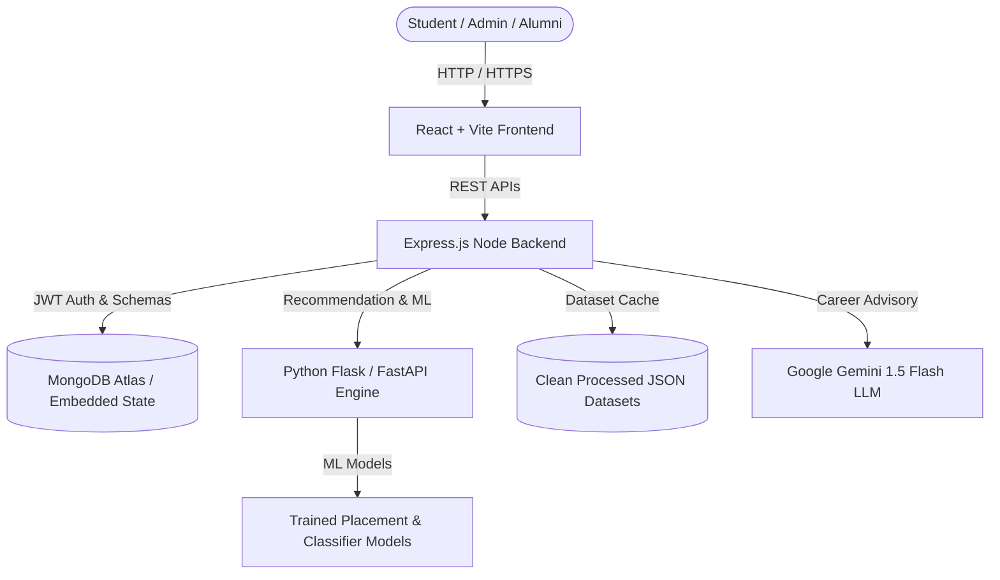

# System Architecture & Technical Specifications

## 1. Overview
The **AI Career Pathway Exploration Platform** is a multi-tier, intelligent career advisory system designed for university students, educators, and alumni. It bridges the gap between academic progress and real-world industry demands using machine learning, hybrid recommendation scoring, alumni knowledge networks, and LLM-powered advisory.

---

## 2. Frontend Tier (Client)
- **Framework**: React 19 + Vite 6
- **Styling**: Tailored Dark-Mode Glassmorphism Design System with Custom CSS variables.
- **Routing**: React Router DOM v7 (16 modular pages + Protected route guards).
- **Data Visualization**: Recharts (Pie, Bar, Area, Radar, Line charts).
- **Icons**: Lucide React.
- **State Management**: Custom React Context (`AuthContext`) & custom hooks (`useProfile`, `useRecommendations`).

---

## 3. Backend Tier (Server)
- **Framework**: Express.js (Node.js v24+)
- **Architecture**: Clean 3-tier Layered Architecture:
  - `routes/`: Declarative HTTP routing with authentication guards.
  - `controllers/`: Input validation and HTTP response mapping.
  - `services/`: Core business logic, hybrid algorithms, and cache management.
  - `models/`: Mongoose schemas for MongoDB with indexing.
  - `middleware/`: JWT verification, Role-based access control, file upload (Multer).
- **Resilience Strategy**: Dual-mode data access (Active MongoDB connection with automatic graceful fallback to in-memory/JSON dataset caching).

---

## 4. AI & Machine Learning Tier (Python-AI)
- **Framework**: Python 3.13 / Flask REST API
- **Algorithms**:
  - **Random Forest & XGBoost**: Student placement outcome and package prediction.
  - **TF-IDF & Cosine Similarity**: Skill gap matching and taxonomy alignment.
  - **SentenceTransformers (`all-MiniLM-L6-v2`)**: Dense vector semantic matching.
  - **Hybrid Scoring Engine**: Weighted multi-factor recommendation.
- **LLM Integration**: Google Gemini 1.5 Flash for personalized career roadmap prompts and interactive Q&A.

---

## 5. Security & Deployment
- **Authentication**: Stateless JSON Web Tokens (JWT) with bcrypt password hashing.
- **CORS**: Domain whitelisting with credentials support.
- **Environment**: Configured via `.env` files for zero secret leakage.
- **Deployability**: Vercel/Netlify for Frontend, Render/Railway/AWS EC2 for Server and Python AI.
